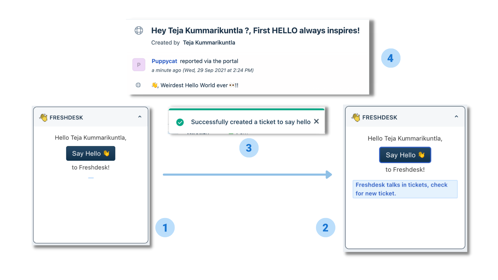

# Say Hello app

Let’s Say Hello👋 to Freshdesk.
This app lets you say `Hello` to Freshdesk and responds you with a ticket.

## Functionality

Upon clicking the button `Say Hello👋` , a ticket is created with a successful notification.

### Steps to run app

1. Follow the steps in the documentation [here](https://developer.freshdesk.com/v2/docs/quick-start) to get started with the platform.
2. Execute the command, `fdk run` to run the app.

### Platform features used

1. [Data API](https://developer.freshdesk.com/v2/docs/data-api) - to fetch the logged in user.
2. [Request API](https://developer.freshdesk.com/v2/docs/request-api) - to make API call for ticket creation.
3. [Interface API](https://developer.freshdesk.com/v2/docs/interface-api/#ticketshownotify) - to show notification to the user.

### Freshdesk APIs used

1. [Create ticket API](https://developer.freshdesk.com/api/#create_ticket) - to create a ticket on request.
