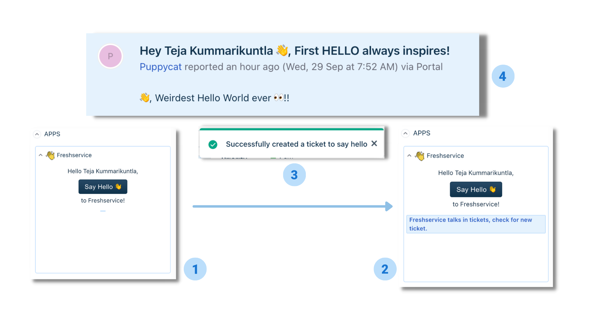

# Say Hello app

Let’s Say Hello👋 to Freshservice.
This app lets you say `Hello` to Freshservice and responds you with a ticket.

## Functionality

Upon clicking the button `Say Hello👋` , a ticket is created with a successful notification.

### Steps to run app

1. Follow the steps in the documentation [here](https://developers.freshservice.com/docs/quick-start/) to get started with the platform.
2. Execute the command, `fdk run` to run the app.

### Platform features used

1. [Data API](https://developers.freshservice.com/docs/data-methods/) - to fetch the logged in user.
2. [Request API](https://developers.freshservice.com/docs/request-method/) - to make API call for ticket creation.
3. [Interface API](https://developers.freshservice.com/docs/interface-methods/) - to show the notification.

### Freshdesk APIs used

1. [Create ticket API](https://api.freshservice.com/v2/#create_ticket) - to create a ticket on request.
